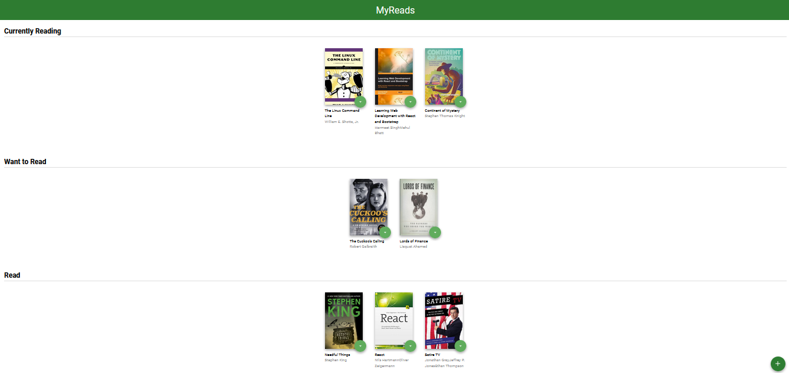
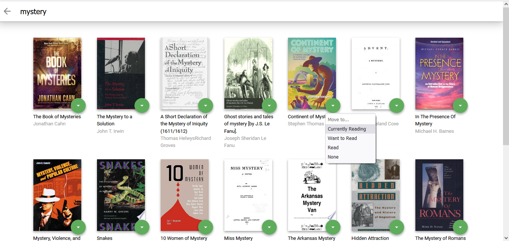

# MyReads App Project

### Overview

This project uses React to build a library app where the user can search for books based on title or author from the provided API and categorize his books into thre shelves (Currently reading, Want to read and Read).

### Instructions

Cloned the repository from the provided Udacity starter code, and wrote the React code needed to add interactivity to the app. (Link found in Credits section)

### Description

-Cloned the starter code repository provided by Udacity and used npm to install the dependencies.

-Seperated the app.js file into three components (MainPage.js, SearchPage.js and Book.js).

-In the App.js, I got the books using the GetAll method provided in the src/BooksAPI.js and definded a moveBook function to move the books between different shelves.

-In the MainPage.js file, the different shelves are rendered on the page using the Book.js component.

-In the SearchPage.js, I used the searchAPI method to enable the user to search for books based on their title or their authors, and the books are rendered again by using the book.js component.

-The Book.js component which is needed for both, the Main page and the Search page. Also, each book has a dropdown list where the user can check the shelves they want to move the book into, or remove it completely from their library.

### Installation

To get started:

- Clone the repository by `git clone <repo>` or download the ZIP.
- Run `npm install` to install project dependenacies.
- Run `npm start` to start the developmental server on port 3000.

### Demo

Home Page

Search Page

### Credits:

-starter code provided by Udacity from https://github.com/udacity/reactnd-project-myreads-starter

-Tutorial guide on reactjs.org https://reactjs.org/docs/thinking-in-react.html

-Course notes by James Priest https://james-priest.github.io/udacity-nanodegree-react/course-notes/react-fundamentals.html

-Study jam by Maeva NAP https://www.youtube.com/watch?v=i6L2jLHV9j8
